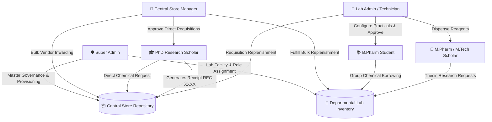
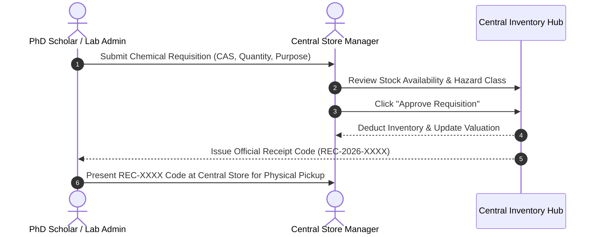

<div align="center">

# 🧪 RasayanFlow 2.0
### *Next-Generation Pharmacy Laboratory & Central Store Intelligence Ecosystem*

[](https://github.com)
[](https://github.com)
[](https://github.com)
[](https://github.com)

---

<p align="center">
  <b>RasayanFlow 2.0</b> is an enterprise-grade academic pharmacy management ecosystem designed specifically for pharmaceutical institutes. It unifies central store bulk inventory, departmental research laboratories, practical curriculum coursework, and doctoral thesis requisitions into a single, seamless, role-aware digital platform.
</p>

</div>

---

## 🌟 Executive Summary

Traditional pharmacy laboratories face critical operational challenges, including untracked chemical consumption, manual store receipts, safety threshold oversights, and complex multi-department borrowing workflows. 

**RasayanFlow 2.0** resolves these challenges by introducing:
- **Central Store Operations**: Real-time monetary valuation, vendor bulk receiving, and low-stock alerts.
- **Direct PhD Scholar Requisitions**: Independent store access bypassing intermediate lab queues, backed by automated **Store Receipt Code (`REC-2026-XXXX`)** generation.
- **Departmental Lab Governance**: Comprehensive practical experiment setup, group-based chemical borrowing, and student request approvals.
- **Academic Hierarchy Support**: Tailored interfaces for B.Pharm, M.Pharm, M.Tech, PhD Scholars, Lab Technicians, Store Managers, and Super Administrators.
- **30+ Year Historical Ledger**: Complete historical audit tracking from 2026 through 2056 with full PDF and CSV export capabilities.

---

## 🔄 System Architecture & Operational Workflow



---

## 📋 Role-Aware System Manual & Operational Flow

RasayanFlow 2.0 automatically tailors its interface and operational workflow based on the active user's authenticated role and academic program.

### 🛡️ 1. Super Admin (Master Governance)
- **Primary Mandate**: Oversees institutional system configuration, user role allocations, laboratory provisioning, central store financial metrics, and audit compliance.
- **Key Capabilities**:
  - Provisioning new pharmacy laboratories (*e.g., Organic Chemistry, Pharmaceutics, Pharmacology*).
  - Setting safety stock threshold limits and assigning dedicated Lab Admins.
  - Institutional user approval, password resets, and role modifications.
  - Live activity monitoring and regulatory compliance reporting.

---

### 🏪 2. Central Store Manager
- **Primary Mandate**: Manages the institute’s primary chemical and equipment repository, vendor shipments, lab stock dispatches, and PhD scholar requisitions.
- **Key Capabilities**:
  - Inwarding new chemical shipments manually or via **Bulk CSV/Spreadsheet Imports**.
  - Reviewing and approving direct chemical requests from PhD Scholars.
  - Automated **Store Receipt Code (`REC-2026-XXXX`)** generation upon stock release.
  - Fulfilling bulk lab stock replenishment requests submitted by Lab Admins.
  - Real-time stock valuation monitoring and reorder level alerts.



---

### 🔬 3. Lab Admin (Laboratory In-Charge)
- **Primary Mandate**: Manages specific departmental lab facilities, practical experiment setups, student chemical borrow approvals, and store stock replenishment.
- **Key Capabilities**:
  - Configuring practical experiment sessions and group chemical allocation limits.
  - Reviewing and approving real-time student borrow requests during lab practicals.
  - Submitting bulk chemical replenishment requests to the Central Store Manager.
  - Monthly and yearly lab history archiving with CSV and PDF export options.

---

### 🎓 4. PhD Research Scholar
- **Primary Mandate**: Conducts independent doctoral research with direct requisition rights to the Central Store Manager.
- **Key Capabilities**:
  - Bypassing intermediate lab quotas with **Direct Central Store Requisition** rights.
  - Mapping requisitions with Thesis Title, Guide/Supervisor Name, and Reaction Objectives.
  - Real-time **Store Receipt Code (`REC-XXXX`)** tracking for physical chemical pickup.

---

### 🧪 5. M.Pharm & M.Tech Research Scholars
- **Primary Mandate**: Performs post-graduate thesis research, pilot-scale formulation, process optimization, and heavy analytical testing.
- **Key Capabilities**:
  - Requisitioning high-purity reagents and analytical grade solvents.
  - Reserving time slots for heavy analytical equipment (*HPLC, Lyophilizer, UV-Vis Spectrophotometers*).
  - Logging synthesis yield parameters and reconciling raw material consumption.

---

### 📚 6. B.Pharm Undergraduate Students
- **Primary Mandate**: Participates in scheduled academic practical coursework and group experiment borrowing.
- **Key Capabilities**:
  - Accessing Year & Semester structured practical schedules (Y1–Y4, Sem 1–8).
  - Submitting group-based chemical and glassware borrow requests for pre-configured practicals.
  - Viewing experiment safety protocols, required chemical lists, and return history.

---

## ✨ Key Features & Technical Highlights

| Feature Module | Description & Capability |
| :--- | :--- |
| 🧪 **PubChem Chemical Integration** | Auto-completes CAS numbers, molecular formulas, SMILES strings, and safety hazard classes directly from chemical databases. |
| 🏷️ **Store Receipt Code System** | Generates unique, verifiable receipt codes (`REC-2026-XXXX`) for authorized stock collection and audit tracking. |
| 📊 **Financial Inventory Valuation** | Calculates live monetary capitalization of inventory, released lab stock value, and stockout opportunity losses in Indian Rupees (₹). |
| 📜 **30+ Year Historical Ledger** | Scalable historical architecture supporting monthly and annual archival records from **2026 through 2056**. |
| 📱 **Responsive Aesthetic Design** | Glassmorphism UI components, sage/emerald color system, custom dark mode, and full mobile optimization. |
| 📄 **One-Click Export Suite** | Instantly export inventory catalogs, audit trails, store receipts, and monthly ledgers into formatted **PDF** and **CSV** files. |

---

## 🛠️ Technology Stack

RasayanFlow 2.0 is built on a robust, decoupled architecture engineered for high throughput, real-time reactivity, and role-aware security compliance.

| Layer | Technology / Library | Role & Capability |
| :--- | :--- | :--- |
| **Frontend Framework** |  | Component-driven single-page architecture |
| **Build System** |  | Instant HMR compilation and production bundling |
| **State Management** |  | Lightweight, predictable role-aware store management |
| **Design System** |   | Glassmorphism cards, sage/emerald theme, dark mode |
| **Icons & UI** |  | Modern iconography across all role dashboards |
| **Export Suite** | `jsPDF` • `PapaParse` • `XLSX` | Client-side PDF receipt generation & CSV/Excel processing |
| **Backend Runtime** |  | Asynchronous event-driven server runtime |
| **API Framework** |  | RESTful API service endpoints and middleware pipelines |
| **Authentication** |  | Encrypted JSON Web Token role-based access control |
| **Real-Time Engine** |  | Bi-directional websocket engine for live updates |
| **Database Engine** |  | Document database for inventory models & 30+ year audit logs |
| **Scientific Data** |  | Automated CAS lookup, SMILES IDs, and molecular structure data |

---

## 🚀 Quick Setup & Local Development

### Prerequisites
- **Node.js** (v18.0.0 or higher)
- **npm** (v9.0.0 or higher)

### Installation Steps

1. **Clone the Repository**:
   ```bash
   git clone https://github.com/rasayanflowsgsits-creator/RasayanFlow2.0.git
   cd RasayanFlow2.0
   ```

2. **Frontend Setup**:
   ```bash
   cd frontend
   npm install
   npm run dev
   ```

3. **Production Verification Build**:
   ```bash
   npm run build
   ```

---

<div align="center">

### 🏛️ Institutional Compliance & Safety Governance
*Designed for Pharmacy Colleges, Research Institutions, and Industrial Training Laboratories.*

**RasayanFlow 2.0** • *Building the Future of Pharmaceutical Laboratory Intelligence*

</div>
