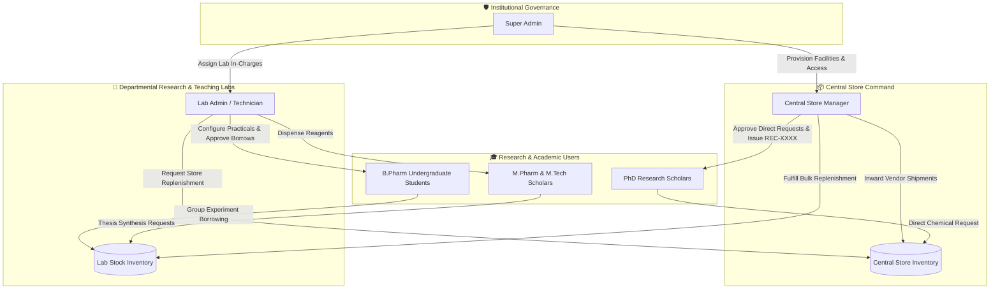
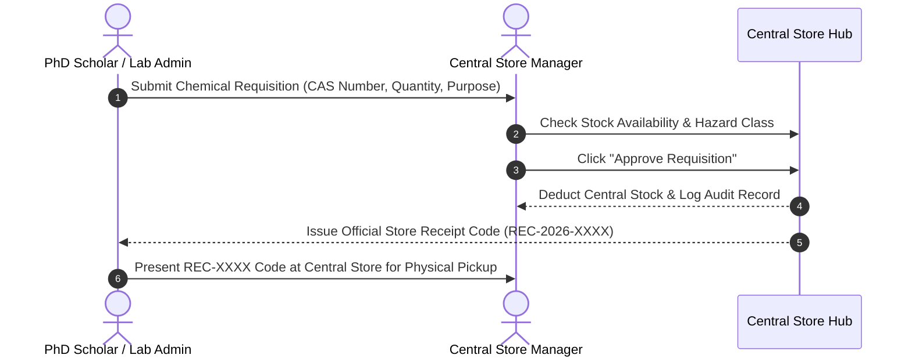

<div align="center">

```text
  ____                                      _____ _               ____    ___  
 |  _ \ __ _ ___  __ _ _   _  __ _ _ __    |  ___| | _____      _|___ \  / _ \ 
 | |_) / _` / __|/ _` | | | |/ _` | '_ \   | |_  | |/ _ \ \ /\ / / __) || | | |
 |  _ < (_| \__ \ (_| | |_| | (_| | | | |  |  _| | | (_) \ V  V / / __/ | |_| |
 |_| \_\__,_|___/\__,_|\__, |\__,_|_| |_|  |_|   |_|\___/ \_/\_/ |_____(_)___/ 
                       |___/                                                   
```

### 🧪 *Smart Pharmacy Laboratory & Central Store Intelligence Ecosystem*

[](https://github.com)
[](https://github.com)
[](https://github.com)
[-556b2f?style=for-the-badge&logo=database&logoColor=white)](https://github.com)

---

<p align="center">
  <b>RasayanFlow 2.0</b> transforms pharmaceutical education and research management. It bridges the gap between central store bulk inventory, departmental research laboratories, practical curriculum execution, and doctoral thesis synthesis in one unified, role-aware digital platform.
</p>

[✨ Explore Features](#-key-capabilities--spotlight) • [👥 Role Manuals](#-role-operational-manuals) • [🔄 Architecture](#-system-architecture--workflows) • [🛠️ Tech Stack](#%EF%B8%8F-technology-stack) • [🚀 Quick Start](#-quick-start)

</div>

---

## ⚡ Quick Metrics & Highlights

<div align="center">

| 📦 Inventory Capitalization | 🧾 Verification Engine | 🎓 Research Requisitions | 📅 Archival Scale |
| :---: | :---: | :---: | :---: |
| **Real-time Valuation (₹)** | **Instant Receipt Codes (`REC-XXXX`)** | **Direct PhD Store Access** | **30+ Years Ledger (2026–2056)** |

</div>

---

## 📌 Table of Contents
- [✨ Executive Overview](#-executive-overview)
- [🔄 System Architecture & Workflows](#-system-architecture--workflows)
- [👥 Role Operational Manuals](#-role-operational-manuals)
  - [🛡️ Super Admin (Master Governance)](#%EF%B8%8F-1-super-admin-master-governance)
  - [🏪 Central Store Manager](#-2-central-store-manager)
  - [🔬 Lab Admin (Departmental Operations)](#-3-lab-admin-laboratory-in-charge)
  - [🎓 PhD Research Scholar](#-4-phd-research-scholar)
  - [🧪 M.Pharm & M.Tech Scholars](#-5-mpharm--mtech-scholars)
  - [📚 B.Pharm Undergraduate Students](#-6-bpharm-undergraduate-students)
- [✨ Key Capabilities & Spotlight](#-key-capabilities--spotlight)
- [🛠️ Technology Stack](#%EF%B8%8F-technology-stack)
- [🚀 Quick Start](#-quick-start)

---

## ✨ Executive Overview

In academic pharmaceutical institutes, managing chemical inventory across central stores and multiple departmental laboratories presents severe challenges:
1. **Unmonitored Chemical Depletion**: Absence of real-time safety thresholds leads to sudden practical session cancellations.
2. **Requisition Bottlenecks**: Doctoral scholars face delayed lab approvals for high-priority thesis synthesis.
3. **Paper Receipts & Audit Deficits**: Inability to verify physical chemical collections or generate instant regulatory reports.

**RasayanFlow 2.0** solves these challenges through:
- **Central Store Capitalization**: Live tracking of pure-grade chemicals, analytical solvents, and apparatus with financial valuation in INR (₹).
- **Automated Store Receipt Codes**: Every approved request instantly emits a unique, verifiable **`REC-2026-XXXX`** code for physical pickup.
- **Direct PhD Requisitions**: Doctoral researchers bypass intermediate lab queues to request directly from the Central Store Manager.
- **30+ Year Historical Ledger**: Full transaction auditing spanning **2026 through 2056** with instant PDF & CSV export suites.

---

## 🔄 System Architecture & Workflows

### 🌐 System Execution Hierarchy



---

### 🧾 Requisition & Receipt Code (`REC-XXXX`) Sequence



---

## 👥 Role Operational Manuals

### 🛡️ 1. Super Admin (Master Governance)
> **Mandate**: Holds master governance over system configuration, user role allocations, laboratory provisioning, central store financial oversight, and compliance auditing.

- **Key Capabilities**:
  - **User & Permission Provisioning**: Approve account registrations and assign roles across departments.
  - **Facility Setup**: Provision new laboratories (*e.g., Pharmaceutics, Organic Chemistry*), set chemical thresholds, and assign lab in-charges.
  - **Master Audit Trail**: Inspect live security logs, active logins, and institutional compliance metrics.

---

### 🏪 2. Central Store Manager
> **Mandate**: Controls the institute's central chemical and equipment repository, bulk vendor receiving, lab stock fulfillment, and direct PhD scholar requisitions.

- **Key Capabilities**:
  - **Bulk Inwarding**: Upload new supplier chemical shipments via **Bulk CSV/Spreadsheet Imports** or manual entry.
  - **PhD Direct Approvals**: Review doctoral chemical requisitions and issue official **`REC-2026-XXXX`** Store Receipt Codes.
  - **Lab Dispatch**: Process bulk chemical replenishment requests submitted by Lab Admins.
  - **Financial Metrics**: Track total inventory capitalization, released stock value, and low-stock warnings.

---

### 🔬 3. Lab Admin (Laboratory In-Charge)
> **Mandate**: Oversees daily lab operations, practical experiment setups, student chemical borrow request approvals, and store stock replenishment.

- **Key Capabilities**:
  - **Practical Setup**: Configure practical sessions (*e.g., Synthesis of Aspirin*), assign group chemical limits, and publish to students.
  - **Borrow Approvals**: Review and approve student chemical borrow requests during practical hours.
  - **Store Replenishment**: Requisition bulk chemical stock replenishment from the Central Store Manager.
  - **Archiving & Audit**: Filter stock movement by year/month and export PDF/CSV audit reports.

---

### 🎓 4. PhD Research Scholar
> **Mandate**: Conducts independent doctoral research with direct requisition rights to the Central Store Manager.

- **Key Capabilities**:
  - **Direct Store Access**: Submit chemical requisitions directly to the Central Store Manager, bypassing lab quotas.
  - **Thesis Mapping**: Map requests with Thesis Project Title, Supervisor/Guide Name, and Reaction Objectives.
  - **Receipt Tracking**: Receive instant **`REC-XXXX`** Store Receipt Codes on approved requests for chemical pickup.

---

### 🧪 5. M.Pharm & M.Tech Scholars
> **Mandate**: Conducts post-graduate thesis research, pilot-scale formulation, process optimization, and analytical testing.

- **Key Capabilities**:
  - Requisitioning high-purity reagents and analytical grade solvents.
  - Slotting heavy analytical machinery (*HPLC, Lyophilizers, UV-Vis Spectrophotometers*).
  - Logging synthesis yield parameters and reconciling raw material usage.

---

### 📚 6. B.Pharm Undergraduate Students
> **Mandate**: Participates in scheduled academic practical coursework and group experiment borrowing.

- **Key Capabilities**:
  - Accessing Year & Semester structured practical schedules (Y1–Y4, Sem 1–8).
  - Submitting group chemical borrow requests for pre-configured practical experiments.
  - Viewing safety protocols, required chemical lists, and glassware return statuses.

---

## ✨ Key Capabilities & Spotlight

```carousel

<!-- slide -->

<!-- slide -->

```

| Feature Module | Description & Capability |
| :--- | :--- |
| 🧪 **PubChem Chemical Integration** | Auto-completes CAS numbers, molecular formulas, SMILES identifiers, and hazard classes. |
| 🏷️ **Store Receipt Code System** | Generates unique, verifiable receipt codes (`REC-2026-XXXX`) for physical stock collection. |
| 📊 **Financial Inventory Valuation** | Calculates live monetary inventory value, released lab stock value, and stockout deficit in INR (₹). |
| 📜 **30+ Year Historical Ledger** | Scalable historical architecture supporting monthly and annual records from **2026 to 2056**. |
| 📱 **Responsive Aesthetic Design** | Glassmorphism UI cards, sage/emerald color system, custom dark mode, and full mobile support. |
| 📄 **One-Click Export Suite** | Export inventory catalogs, audit logs, store receipts, and monthly ledgers into formatted **PDF** and **CSV** files. |

---

## 🛠️ Technology Stack

RasayanFlow 2.0 is built on a modern, decoupled architecture designed for reactivity, scalability, and security compliance.

| Layer | Technology / Library | Role & Capability |
| :--- | :--- | :--- |
| **Frontend Framework** |  | Component-driven single-page application |
| **Build Engine** |  | Instant HMR compilation and production bundling |
| **State Management** |  | Centralized, lightweight role-aware store management |
| **Design System** |   | Glassmorphism cards, sage/emerald palette, dark mode |
| **Icons & UI** |  | Modern iconography across all dashboards |
| **Export Suite** | `jsPDF` • `PapaParse` • `XLSX` | Client-side PDF receipt generation & CSV/Excel processing |
| **Backend Runtime** |  | Asynchronous event-driven server runtime |
| **API Framework** |  | RESTful API service endpoints and middleware |
| **Authentication** |  | Encrypted JSON Web Token role-based access control |
| **Real-Time Engine** |  | Bi-directional websocket engine for live updates |
| **Database Engine** |  | Document database for inventory models & 30+ year audit logs |
| **Scientific Data** |  | Automated CAS lookup, SMILES IDs, and molecular structure data |

---

## 🚀 Quick Start

### Prerequisites
- **Node.js**: v18.0.0 or higher
- **npm**: v9.0.0 or higher

### Installation & Launch

1. **Clone Repository**:
   ```bash
   git clone https://github.com/rasayanflowsgsits-creator/RasayanFlow2.0.git
   cd RasayanFlow2.0
   ```

2. **Frontend Development Setup**:
   ```bash
   cd frontend
   npm install
   npm run dev
   ```

3. **Production Build Validation**:
   ```bash
   npm run build
   ```

---

<div align="center">

### 🏛️ Institutional Compliance & Safety Governance
*Engineered for Pharmacy Colleges, Research Institutions, and Industrial Training Laboratories.*

**RasayanFlow 2.0** • *Building the Future of Pharmaceutical Laboratory Intelligence*

</div>
